# Practica_master_slave
Este repositorio contiene la práctica de despliegue de aplicaciones web con configuración de DNS.

1. Inicialicé el archivo `Vagrantfile` utilizando el comando `vagrant init`.
2. Configuré las máquinas virtuales siguiendo las indicaciones del ejercicio 2. Se utilizaron boxes de Vagrant, específicamente bullseye64. A cada máquina le asigné un nombre de host, una IP fija y añadí un script de provisión que actualiza la VM e instala las herramientas necesarias para el uso de DNS.

3. En la máquina `Tierra`, configuré el archivo `named.conf.options` para:
   1. Deshabilitar la escucha en direcciones IPv6.
   2. Permitir consultas desde la red interna.
   3. Habilitar las consultas recursivas.
   4. Activar DNSSEC.
   5. Configurar la dirección `208.67.222.222` para el reenvío de consultas.

   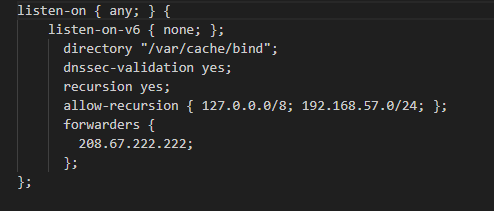

4. Edité el archivo `named.conf.local` en `Tierra`, dándole autoridad sobre las zonas directa e inversa.

   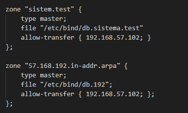

5. Creé y configuré los archivos `db.sistema.test` y `db.192`, donde definí los detalles de las zonas. En estos archivos especifiqué los puertos para las distintas conexiones.

   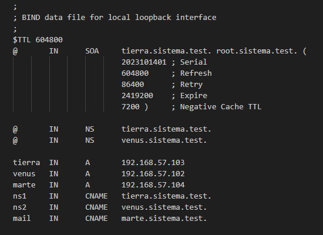

   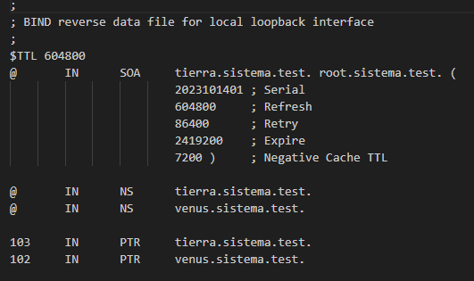

6. Después de configurar la máquina `Tierra`, pasé a realizar la configuración del DNS en la máquina `Venus`. Modifiqué el archivo `named.conf.local` para añadir la configuración de las zonas directa e inversa.

   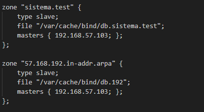

7. Una vez que todos los archivos fueron editados correctamente, ajusté la provisión de cada VM para que copie los archivos a los directorios correspondientes, asegurando que el sistema sea replicable en otros entornos. Añadí varias líneas de código en los scripts de provisión para este propósito.

8. Finalmente, realicé las comprobaciones requeridas en la práctica para verificar que la configuración del DNS era correcta.

   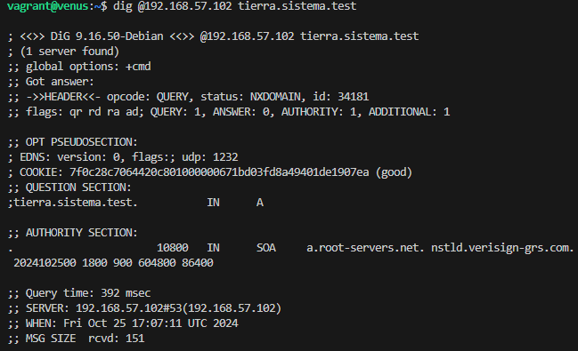

   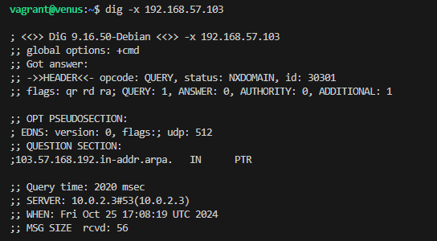

   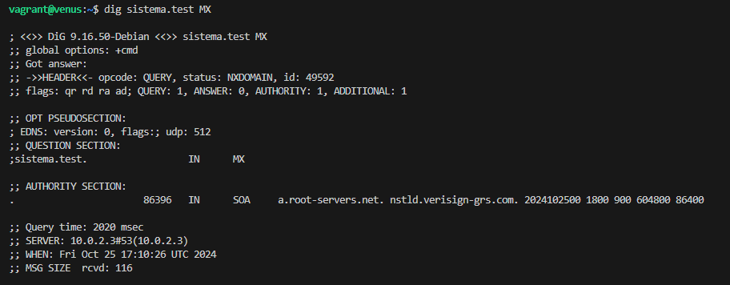

   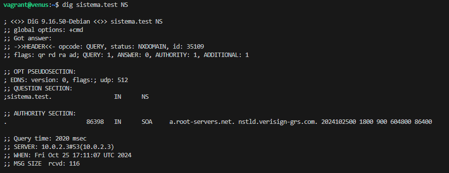

   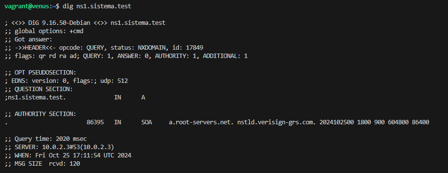

   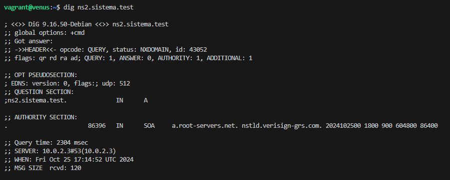

   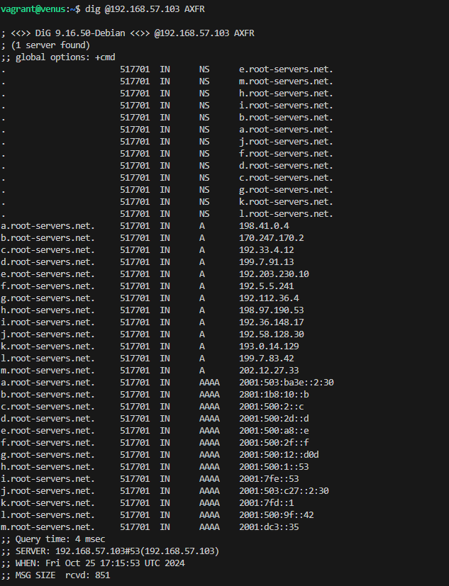
